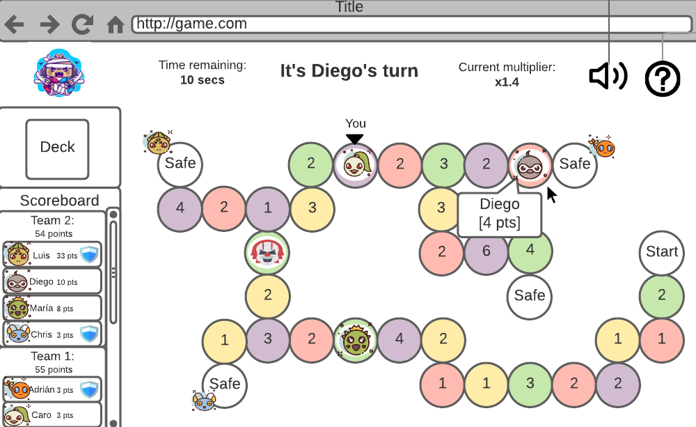

# ZOMBIE JUMP

## Objetivo del proyecto: 
Construir con propósitos pedagógicos una aplicación web que permita jugar de forma distribuida una adaptación del juego de mesa Hoot Owl Hoot!.
Referencia del juego de mesa [Hoot Owl Hoot!.](https://www.amazon.com/-/es/Juego-mesa-cooperativo-Peaceable-Kingdom/dp/B004HVKAAI)  

[Instrucciones del proyecto realizado](http://jeisson.ecci.ucr.ac.cr/appweb/2021a/proyecto/)

## Autores:
Luis Eduardo Rojas Carrillo.  

Diego Moises Barquero Quesada.  

Jose Alberto Chaves Hurtado.  

## Adaptaciones a implementar en el juego:
1. Desarrollar un juego competitivo entre equipos.
2. Implementar un personaje zombie, enemigo de ambos equipos.
3. Diseñar un mazo de cartas, con los colores para el movimiento de los personajes. Por ejemplo, si sale una carta de tipo jugador y de color rojo, el jugador en turno debe mover uno de los personajes del equipo al próximo color rojo disponible.
4. Crear un movimiento de zombie mediante cartas de movimiento por colores. Por ejemplo, si sale una carta de tipo zombie y de color azul, el jugador en turno define en que posición azul moverá el zombie (único personaje que puede moverse hacia atrás).
5. Establecer la pérdida de personajes de los equipos en competición mediante el personaje zombie. Si el zombie caé en una casilla del tablero ocupada por un personaje de algún equipo, este personaje del equipo es eliminado junto con el puntaje obtenido anteriormente.
6. Implementar la opción de la pérdida de personajes si el zombie logra adelantar un personaje de cualquier equipo (Opción de configuración ON/OFF).
7. Generar la característica de pérdida de personajes si el zombie llega a la zona segura. Si un zombie llega a una zona segura, todas las fichas ubicadas en esta zona son eliminadas del juego junto con el puntaje obtenido anteriormente (Opción de configuración ON/OFF).
8. Establecer el fin del juego mediante la llegada del zombie a una zona segura. Si el zombie llega a una zona segura el juego es finalizado.
9. Implementar el fin del juego si todas los personajes de los equipos son eliminadas por el zombie. Si todas las fichas de los jugadores son consumidas por el zombie se acaba el juego.
10. Establecer el objetivo del juego mediante la zona segura. Los equipos tienen que competir para lograr llevar sus fichas de la posición de inicio a cualquiera de las zonas seguras establecidas en el tablero.
11. Generar diferentes caminos hacia las zonas seguras. Los jugadores pueden llegar a diferentes zonas seguras por medio de diferentres caminos.
Ejemplo de un tablero con diferentes caminos:

12. Diseñar las casillas del tablero con un puntaje aleatorio, el cual será sumado a la ficha individualmente y al equipo.
14. Desarrollar un multiplicador en cascada a partir de el orden en que los personajes lleguen al lugar seguro. Por ejemplo, los puntos del primer personaje en llegar a la zona segura se multiplican (X2), en el caso del segundo jugador en un (X1.75) y así susesivamente (Opción de configuración ON/OFF).
15. Establecer el objetivo del equipo mediante el puntaje. El equipo ganador es el que más puntos obtenga al final del juego.
16. Diseñar el camino del tablero igual en todas las partidas, sin embargo los colores y los puntajes de cada casilla serán aleatorios.