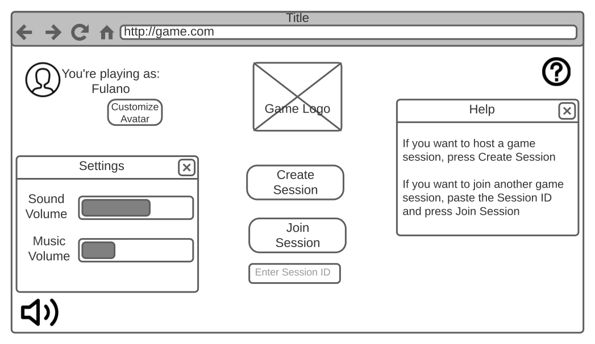
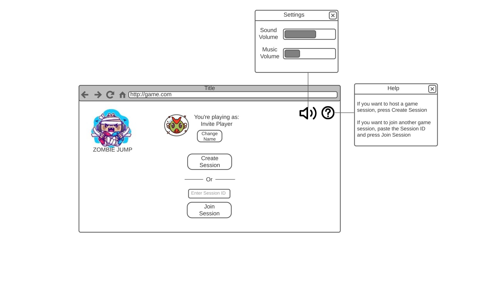
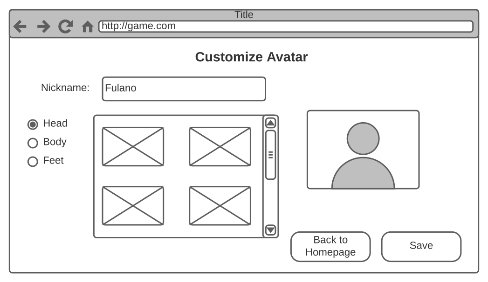
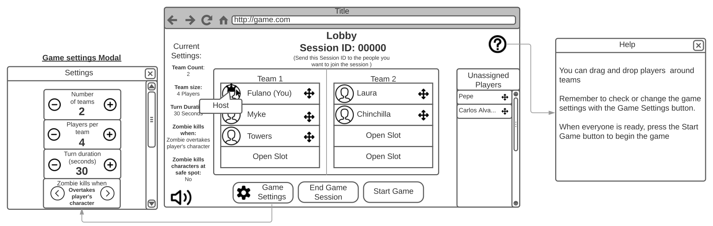
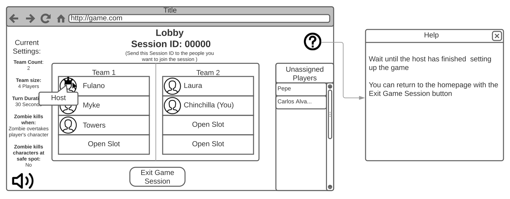
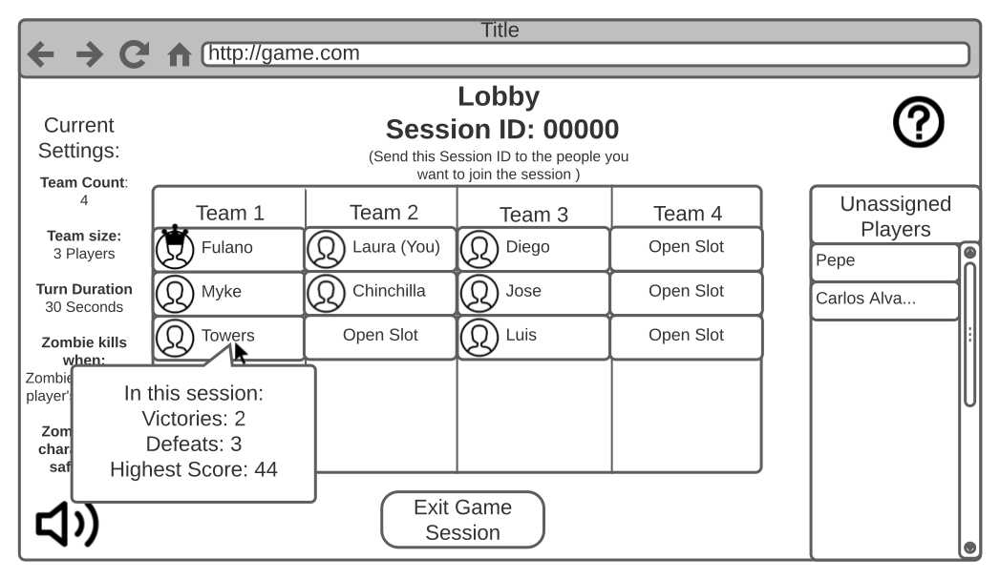
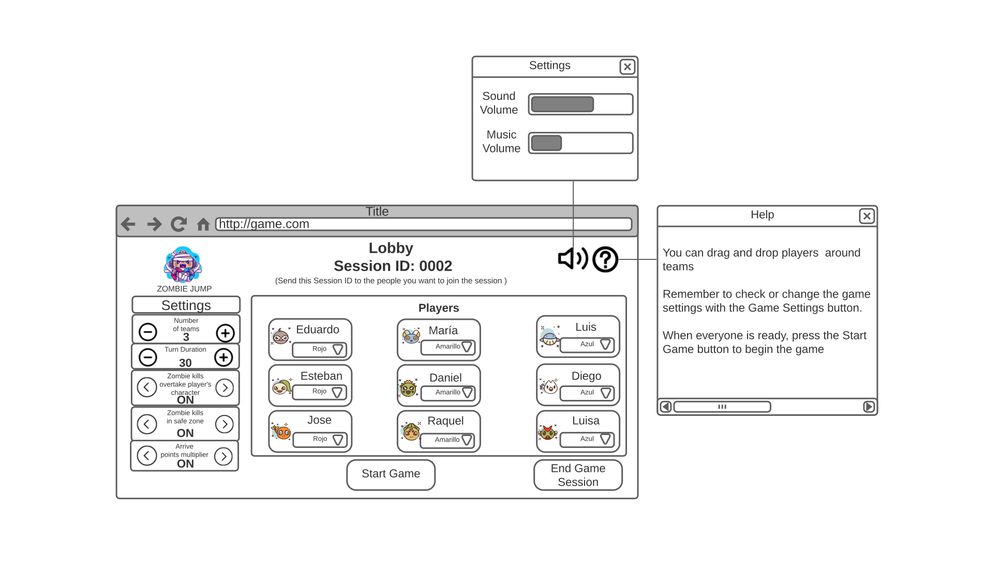
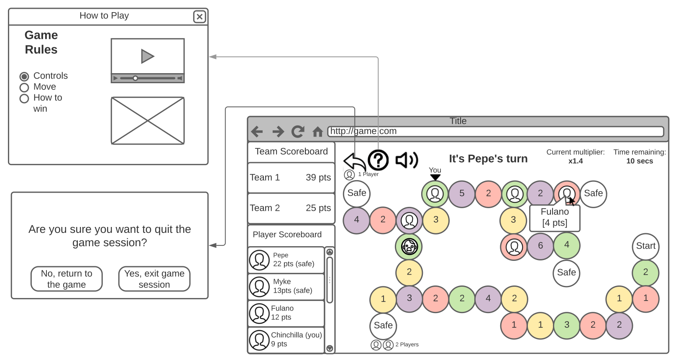
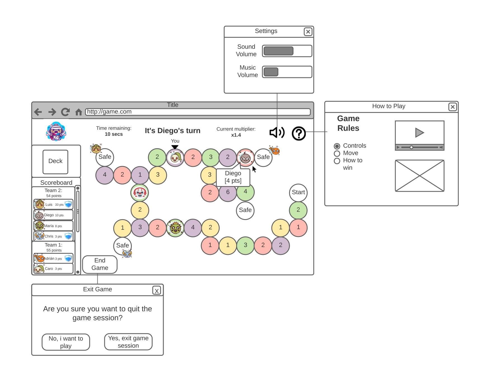
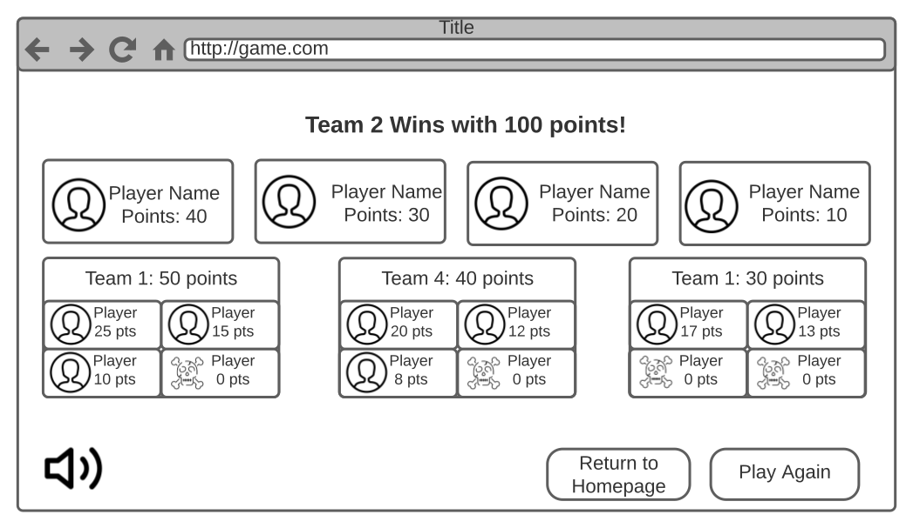

# Diseño
## Mapa del Sitio

## Wireframes
#### Homepage:
Los botones de sonido y configuración propuestos en todas las petañas despliegan una ventana modal.

#### Homepage detallado:
Pantalla de Home, presenta el unirse a partida o crear una.  
Presenta la selección de nombre de usuario.

#### Customize:
Implementación futura, en la que los jugadores pueden seleccionar y caracterizar sus personajes.

#### Lobby como Host de partida:

#### Lobby como invitado:

#### Ejemplo Lobby con cuatro equipos:

#### Lobby detallado final:
El Host de la partida tiene la capacidad de ajustar las opciones de juego y selecionar el equipo de cada jugador. Los invitados tienen deshabilitado los ajustes, deben esperar al host.

#### Pantalla de juego:

#### Pantalla de juego detallada final:
Los jugadores tienen visibilidad de los puntajes por equipo y por jugador en la tabla de puntajes.  
Los jugadores tiene visualización del deck o mazo de cartas.  
Los jugadores tienen visualización del tiempo de cada turno.  
Los jugadores pueden ver el movimeinto de los personajes.  

#### Pantalla de resultados:
Implementación futura, página aparte para la visualización de los resultados.

